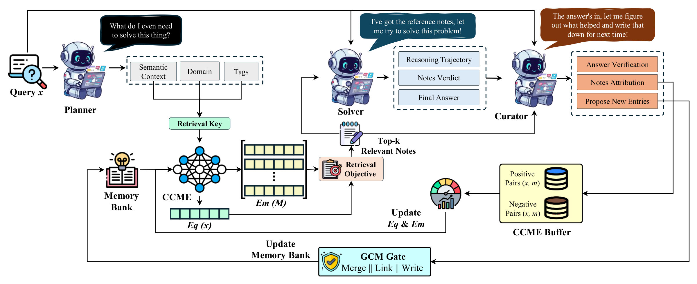

# Learn to Remember (LeRe)

**Geometric Memory for Inference-Time Self-Improvement in Language Models**

LeRe lets a frozen LLM improve while it works through a stream of problems, with no
ground-truth labels and no weight updates. It keeps a memory bank of reusable entries,
learns online which entries actually help, and retrieves them for new queries. This
repository contains the full method, its prompts and hyperparameters, the twelve evaluation
streams in their fixed order, and the scripts behind every table in the paper.

## How it works

<p align="center">
  
  <br>
  <em>The framework of LeRe.</em>
</p>

1. **Plan.** A **Planner** turns each query into a structured retrieval key, a domain and
   tags drawn from a closed vocabulary, so retrieval matches on what a problem requires
   rather than on its surface wording.
2. **Retrieve.** **CCME**, two linear heads on a frozen sentence encoder
   (`all-MiniLM-L6-v2`), scores memory entries against the key, blends that similarity with
   each entry's learned reliability, and returns the top-K (K = 3) with MMR for diversity.
3. **Solve.** A **Solver** answers with the retrieved entries in context, optionally running
   Python in a restricted subprocess.
4. **Curate.** A **Curator** verifies the answer without labels, credits or blames each
   retrieved entry, and proposes new ones. Its attributions train CCME online by a contrastive
   update, so retrieval learns which entries are empirically useful.
5. **Gate.** **GCM** (Guard, Consolidate, Maintain) filters what enters the memory bank:
   it blocks answer leakage and problem restatements, merges near-duplicates, and, once the
   bank is full, prunes entries with low reliability or no use first.

## Results

Mean accuracy gain over the plain backbone (percentage points, averaged over the 12
streams). Best per backbone in **bold**.

| Method | Gemini-3.1-flash-lite | GPT-4.1-mini | GPT-4o-mini |
|---|--:|--:|--:|
| RAG-ICL | -0.2 | -2.3 | -2.2 |
| Dynamic Cheatsheet (Cumulative) | +2.9 | +0.8 | +2.1 |
| Dynamic Cheatsheet (Retrieval & Synthesis) | +3.7 | +2.4 | +3.2 |
| ACE | -0.4 | -1.3 | +0.9 |
| **LeRe** | **+6.9** | **+9.0** | **+4.6** |

Accuracy (%) per stream, backbone alone versus with LeRe:

| Stream | Gemini base | Gemini LeRe | 4.1-mini base | 4.1-mini LeRe | 4o-mini base | 4o-mini LeRe |
|---|--:|--:|--:|--:|--:|--:|
| AIME 2024 | 56.7 | **76.7** | 33.3 | **60.0** | 16.7 | **26.7** |
| AIME 2025 | 30.0 | **60.0** | 23.3 | **56.7** | 3.3 | **20.0** |
| AIME 2020-2025 | 45.1 | **69.8** | 24.1 | **45.1** | 7.4 | **21.6** |
| MATH | **94.0** | **94.0** | 84.0 | **88.4** | **72.8** | 67.2 |
| GPQA-Diamond | 73.2 | **74.7** | **68.2** | 66.7 | 34.3 | **40.9** |
| MMLU-Pro Engineering | 77.6 | **78.0** | 57.6 | **64.0** | **37.6** | 31.6 |
| MMLU-Pro Physics | 86.4 | **90.0** | **82.4** | 81.2 | **55.2** | 54.0 |
| HLE-Exact | 9.6 | **12.4** | 4.8 | **8.4** | 6.8 | **8.4** |
| MathVista | **91.2** | **91.2** | 77.2 | **79.6** | 57.6 | **60.8** |
| MMMU-Pro Standard-4 | **83.2** | 82.0 | 72.8 | **75.2** | 52.4 | **55.2** |
| MMMU-Pro Standard-10 | 75.2 | **76.8** | 61.2 | **63.2** | 37.6 | **41.2** |
| MMMU-Pro Vision | **72.8** | **72.8** | 51.2 | **59.6** | 26.4 | **35.6** |

Numbers are from Table 1 of the paper. The baselines are retrieval-augmented in-context
learning (RAG-ICL), Dynamic Cheatsheet ([Suzgun et al., 2025](https://github.com/suzgunmirac/dynamic-cheatsheet))
in its Cumulative and Retrieval & Synthesis variants, and ACE (Agentic Context Engineering),
all run on the same streams with the same scorer.

## Evaluation streams

| Stream | Domain | Items | Answer |
|---|---|--:|---|
| AIME 2024, AIME 2025 | competition math | 30 each | integer |
| AIME 2020-2025 | competition math | 162 | integer |
| MATH | math | 250 | LaTeX expression |
| GPQA-Diamond | graduate science | 198 | 4 options |
| MMLU-Pro Engineering, Physics | science knowledge | 250 each | up to 10 options |
| HLE-Exact | expert questions (Humanity's Last Exam) | 250 | letter or number |
| MathVista | visual math | 250 | options, image |
| MMMU-Pro Standard-4, Standard-10, Vision | multimodal reasoning | 250 each | options, image |

Each stream is a fixed random permutation of its source (seed 10), processed in the same
order by every method. [`data/README.md`](data/README.md) documents how each was drawn.
GPQA-Diamond and HLE ask that their questions not be republished, so for those two only the
item ids are committed and `scripts/data/fetch_streams.py` rebuilds the files, checked byte
for byte against the paper's copies. Images are fetched the same way.

## Models

| Backbone | API model | Provider |
|---|---|---|
| Gemini-3.1-flash-lite | `gemini-3.1-flash-lite` | Gemini API (OpenAI-compatible endpoint) |
| GPT-4.1-mini | `gpt-4.1-mini` | OpenAI |
| GPT-4o-mini | `gpt-4o-mini` | OpenAI |

Decoding uses temperature 0 and at most 2,048 output tokens per call. List prices for the
cost ledger are in `configs/models/`.

## Repository layout

```
learn-to-remember/
│
├── lere/                              # LeRe core (Section 3)
│   ├── pipeline.py                    # Plan → retrieve → solve → curate loop (Algorithm 1)
│   ├── schema.py                      # Planner / Solver / Curator outputs, memory entry (Eq. 7)
│   ├── embed.py                       # Frozen encoder f + CCME heads E_q, E_m (Eq. 1)
│   ├── ccme.py                        # CCME online contrastive training (Eq. 10-11)
│   ├── retrieve.py                    # Retrieval score (Eq. 3) + MMR top-K
│   ├── memory.py                      # Memory bank, reliability p̂ (Eq. 8), Maintain
│   ├── curate.py                      # Credit assignment (Eq. 12) + Consolidate
│   ├── guard.py                       # Guard: answer leakage / problem restatement
│   ├── verify.py                      # Label-free verification signal
│   ├── tools.py                       # Restricted Python execution for the Solver
│   ├── providers.py                   # OpenAI / Gemini clients + cost ledger
│   ├── llm.py                         # LLM interface + offline stand-in
│   ├── answers.py                     # Answer normalization
│   ├── datasets.py                    # Stream loading (JSONL + images)
│   └── trace.py                       # Run recorders
│
├── prompts/                           # Role prompts (Appendix D.1)
│   ├── planner.md
│   ├── solver.md
│   ├── curator.md
│   └── taxonomy.md                    # Closed domain / tag vocabularies
│
├── configs/
│   ├── lere.yaml                      # All hyperparameters (Table 4)
│   ├── models/                        # Backbones + list prices (Table 3)
│   └── streams.yaml                   # The 12 evaluation streams
│
├── data/
│   ├── subsets/                       # 12 streams in fixed evaluation order (JSONL)
│   └── README.md                      # Sources and sampling (Appendix B.1)
│
├── scripts/
│   ├── run_lere.py                    # Run one stream (--top-k, --no-planner, --no-ccme, --no-exec)
│   ├── run_stream.sh                  # Entry-point launcher
│   ├── run_main.sh                    # Table 1: 12 streams × 3 backbones
│   ├── run_ablations.sh               # Table 2
│   ├── run_k_sweep.sh                 # Table 8
│   ├── eval/
│   │   ├── scoring.py                 # Shared answer scorer (Appendix B.3)
│   │   └── score_runs.py              # Accuracy, cost, runtime per run
│   ├── analysis/
│   │   ├── ccme_geometry.py           # Table 6, Figure 8
│   │   ├── verification_reliability.py  # Table 7
│   │   └── k_sweep_significance.py    # Table 8 tests
│   └── data/
│       ├── fetch_streams.py           # Rebuild GPQA / HLE text + SHA-256 check
│       └── fetch_images.py            # Image download + SHA-256 check
│
├── tests/                             # Unit tests (no API access)
├── API_key.txt.example                # API-key template (copy → API_key.txt)
└── requirements.txt
```

## Setup

```bash
pip install -r requirements.txt                 # tested on Python 3.8
python -m pytest tests/ -q                      # no API access needed
python scripts/data/fetch_streams.py            # GPQA-Diamond and HLE question text
python scripts/data/fetch_images.py             # images for MathVista, MMMU-Pro, HLE
```

Set `OPENAI_API_KEY` and/or `GEMINI_API_KEY` (or copy `API_key.txt.example` to `API_key.txt`).
HLE is gated on Hugging Face: run `huggingface-cli login` before fetching its text and
images. The twelve evaluation streams are in `data/subsets/`, in the order all methods
processed them (see `data/README.md`).

## Usage

```bash
scripts/run_stream.sh gpt-4.1-mini AIME_2025               # one stream, one backbone
scripts/run_stream.sh gpt-4o-mini AIME_2025 --dry-run      # offline, no API calls
python scripts/eval/score_runs.py runs/gpt-4.1-mini/AIME_2025
```

Backbones: `gemini-3.1-flash-lite`, `gpt-4.1-mini`, `gpt-4o-mini`. Streams are listed in
`configs/streams.yaml`. Options: `--top-k K`, `--no-planner`, `--no-ccme`, `--no-exec`,
`--set section.key=value`, `--limit N`, `--out DIR`.

All hyperparameters (Table 4) are in `configs/lere.yaml`; backbones and prices are in
`configs/models/`. Each run directory records every LLM call, retrieval candidate, CCME update
and memory write, plus `report.json` with accuracy, cost and latency.

## Reproducing the paper

```bash
scripts/run_main.sh                    # Table 1: 12 streams x 3 backbones
scripts/run_ablations.sh               # Table 2: w/o Planner, CCME, Execution
scripts/run_k_sweep.sh <backbone>      # Table 8: K in {1, 5, 10}

python scripts/eval/score_runs.py runs/*/* --table                 # accuracy (Appendix B.3 scorer)
python scripts/analysis/ccme_geometry.py runs/*/*                  # Table 6, Figure 8
python scripts/analysis/verification_reliability.py runs/*/*      # Table 7
python scripts/analysis/k_sweep_significance.py runs/*/*          # Table 8 tests
```

Runs use temperature 0 and at most 2,048 output tokens per call, but hosted models can change
over time, so results may differ slightly. Baselines were run with the official Dynamic
Cheatsheet (https://github.com/suzgunmirac/dynamic-cheatsheet) and ACE implementations on the
same streams and scorer.

## Note

The Solver executes model-written Python in a restricted subprocess (no network, no API keys,
time and memory limits). This is not a full sandbox; run experiments in an isolated
environment.

## Citation

The paper is under review. A BibTeX entry will be added here once it is published.

## License

The code is released under the [MIT License](LICENSE). The evaluation streams derive from the
benchmarks listed in [`data/README.md`](data/README.md) and remain subject to their original
licenses.
